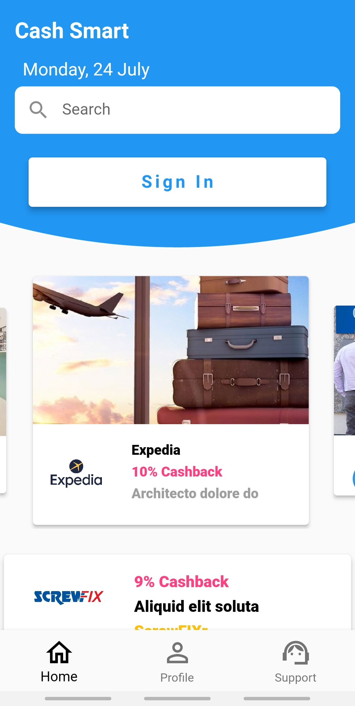
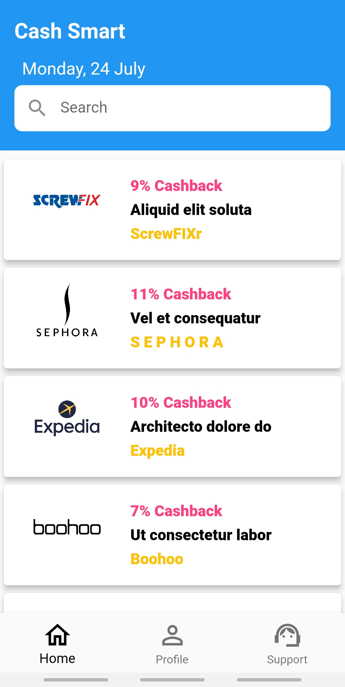
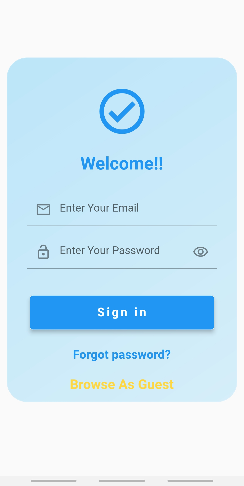
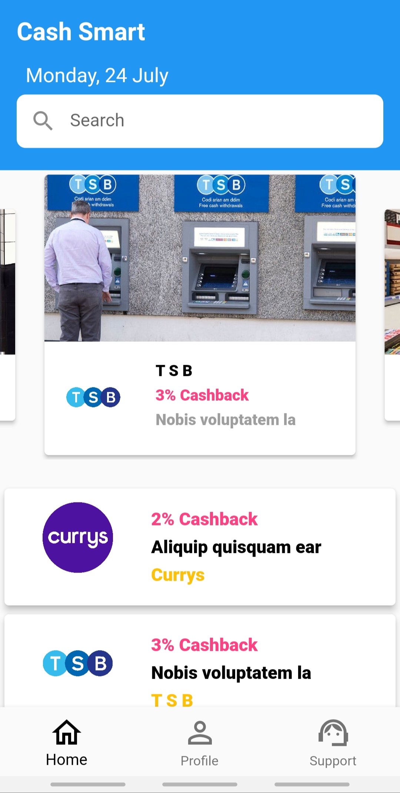
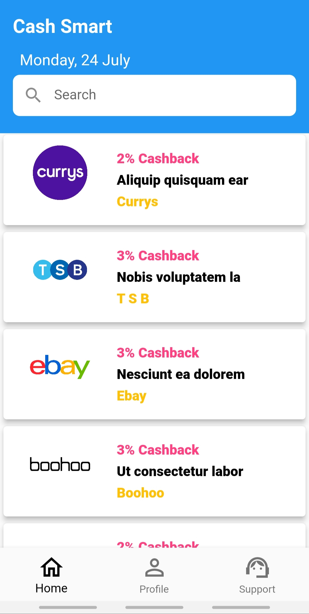
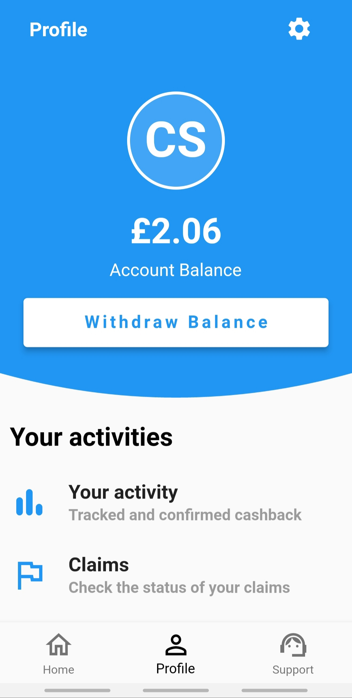
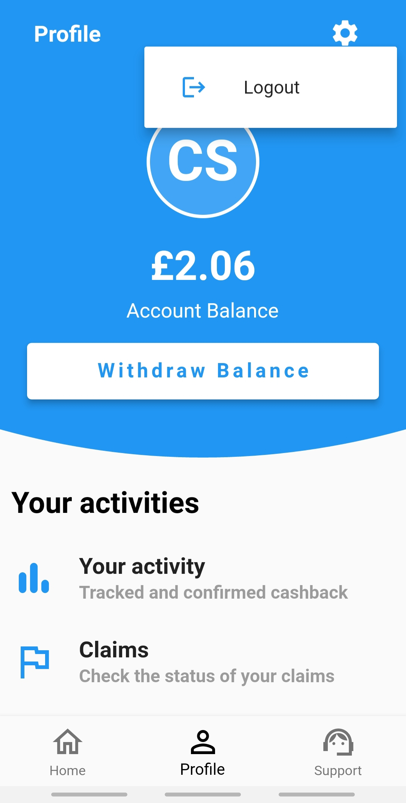

# Cash-Smart-App

## Project Owner
This project is owned and maintained by ***Morshed Raian Khan***.

## Description
Experience Cash Smart App, thoughtfully designed using the robust MVVM (Model-View-ViewModel) architecture. This app sets new standards for a seamless user experience, offering an impressive range of features.

## Key Features
- **MVVM Architecture with Provider:** Leveraging the power of MVVM architecture and the "Provider" package, we ensure optimal state management for smooth data flow and clear separation of concerns.

- **Clean Code with Detailed Comments:** Our codebase boasts clean and well-organized code, complemented by detailed comments for enhanced readability and maintainability, streamlining the development process.

- **API Handling with Dio:** The app efficiently manages API requests and responses using the Dio package, ensuring uninterrupted access to a vast collection of movies.

- **Effective API Response Management:** With meticulous management of diverse API response status codes, we guarantee uninterrupted communication with our backend.

- **Secure Sign-In with Real-Time Validation:** Our app offers a secure sign-in experience, featuring real-time validation for accurate data entry and robust security.

- **Model Classes for Data Management:** Harnessing model classes, we optimize data storage and circulation, delivering a seamless user experience.

- **Modern UI Effects:** Enjoy the elegance of frosted glass UI, custom clipper, and gradient effects that elevate the app's visual appeal.

- **Engaging Carousel Slider:** Immerse yourself in a unique property—a captivating and expandable when centered carousel slider—that showcases specific product images in a captivating manner.

- **Local Storage for Personalization:** With local storage capabilities, the app tailors user preferences and data, ensuring a personalized and seamless journey across sessions.

- **User Persistence and Convenience:** Our app boasts user persistence, ensuring CashSmarts remembers login information, granting hassle-free access on subsequent visits.

- **User-Centric Home Page with Guest Mode Access:** Navigate with ease through our home page, offering quick access to a plethora of features and functionalities, including a guest mode for unhindered exploration.

- **Effortless Navigation with Named Routes and Sliding Transitions:** Seamlessly move through the app with named routes and mesmerizing sliding transitions, enhancing navigation.

- **Convenient Logout Feature:** With a single tap, users can effortlessly sign out, benefiting from our convenient logout feature.

## Screenshots

| Guest Mode Home | Guest Mode Home | Login | Authenticated User Home |
| :-------------: | :-------------: | :---: | :---------------------: |
|  |  |  |  |

| Authenticated User Home | Profile | Profile Logout | Support Call |
| :---------------------: | :-----: | :------------: | :----------: |
|  |  |  |  |

## Installation
1. Clone the repository: `git clone https://github.com/Morshed-GitHub/Cash-Smart.git`
2. Install dependencies: `flutter pub get`
3. Run the app: `flutter run`

## Contributing
Contributions are welcome! If you have any suggestions, bug reports, or feature requests, please open an issue or submit a pull request.
